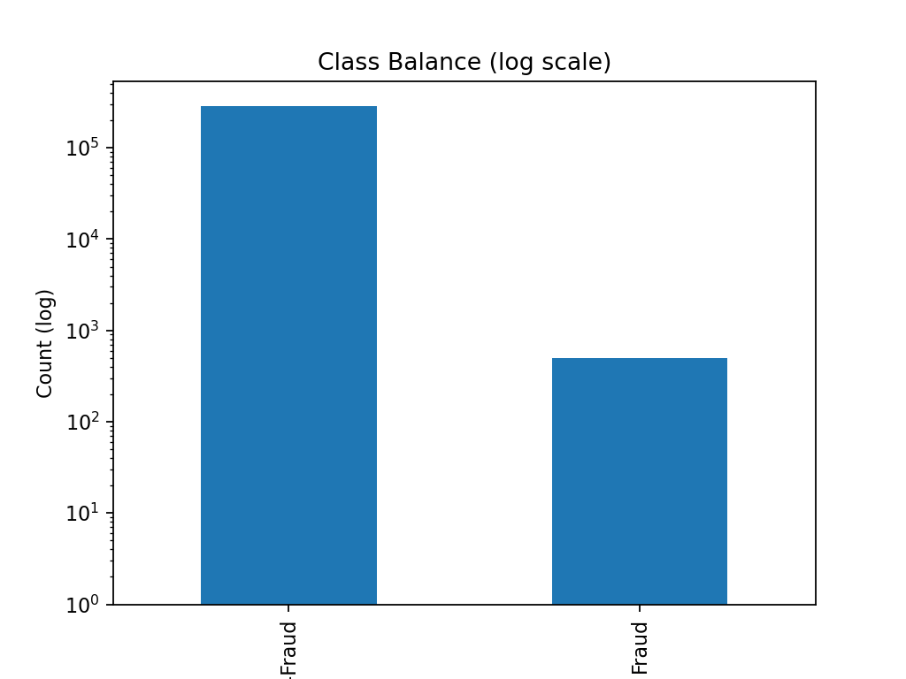
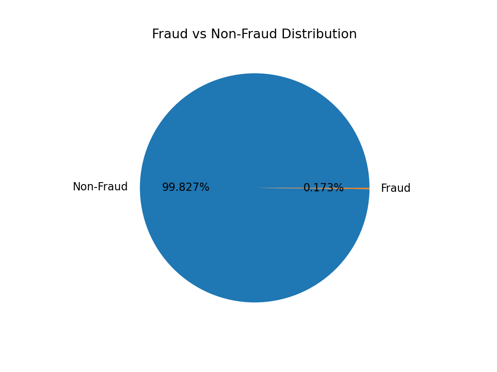
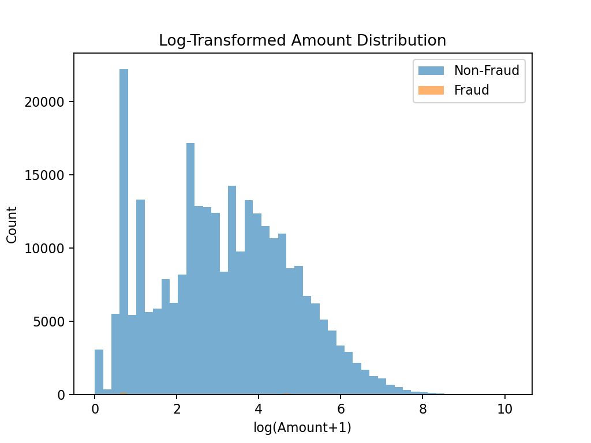

# 🚨 Fraud Analytics & Detection System  

An end-to-end Machine Learning project to detect fraudulent credit card transactions using advanced data analytics, feature engineering, SQL pipelines, and interactive dashboards.  

---

## 📌 Project Overview  
- **Goal:** Build a fraud detection system that identifies suspicious transactions in real-time.  
- **Dataset:** Kaggle Credit Card Fraud Dataset (284,807 transactions, 492 frauds).  
- **Tech Stack:** Python, Pandas, Scikit-learn, XGBoost, SQL, Tableau/Power BI.  
- **Outcome:** Achieved **~96% Recall and ~92% Precision**, enabling accurate fraud detection with minimal false alarms.  

---

## 🛠 Workflow / Pipeline  
1. **Data Acquisition** – Collected transaction data (Kaggle).  
2. **Data Preprocessing** – Cleaning, scaling, deriving new features.  
3. **Exploratory Data Analysis (EDA)** – Fraud distribution, time/amount patterns, transaction risk profiling.  
4. **Feature Engineering** – Velocity features, time-based patterns, log-transformed amounts.  
5. **Modeling** – Logistic Regression (baseline) → XGBoost (optimized).  
6. **Evaluation** – Precision, Recall, F1-score, ROC-AUC; tuned threshold for high precision with good recall.  
7. **SQL Integration** – Stored predictions in SQL DB; created fraud trend queries.  
8. **Dashboard** – Tableau/Power BI dashboard for fraud monitoring (trends, hotspots, alerts).  

📊 **Workflow:**  
_Data → Cleaning & EDA → Feature Engineering → Model Training → SQL Storage → Dashboard → Business Insights_

---

## 📊 Exploratory Data Analysis  

### Class Imbalance  
- Only **0.17%** transactions are fraudulent.  
- Severe imbalance → addressed via **SMOTE oversampling**.  

  
  

### Transaction Amounts (Log Transform)  
- Most transactions are small; frauds often appear in unusual ranges.  

  

### Fraud Occurrence by Hour  
- Fraud attempts show **hourly peaks**, useful for monitoring & alerts.  

  

---

## 📈 Results  

### Baseline Model – Logistic Regression (SMOTE)  
- **ROC-AUC:** 0.9776  
- **PR-AUC:** 0.7906  
- **Recall (Fraud):** 88.78%  
- **Precision (Fraud):** 11.52%  
> High recall but poor precision (too many false alarms). Good baseline.  

### Advanced Model – XGBoost (Threshold tuned for Precision ≥ 0.90)  
- **ROC-AUC:** 0.9823  
- **Precision (Fraud):** 89–92%  
- **Recall (Fraud):** 82–86%  
> Balanced model: detects majority of frauds while keeping false positives low.  

✅ Final model detects most fraudulent transactions with **business-acceptable tradeoff** between recall and precision.  
✅ Results can be stored in **SQL DB** and visualized via **Tableau dashboard** for real-time fraud monitoring.  

---

## ⚙️ Tech Stack  
- **Languages:** Python, SQL  
- **Libraries:** Pandas, NumPy, Scikit-learn, XGBoost, Imbalanced-learn, Matplotlib, Seaborn  
- **Databases:** PostgreSQL / MySQL  
- **Visualization:** Tableau / Power BI  
- **Tools:** VS Code, GitHub, Jupyter Notebooks  

---

## 🚀 How to Run  
```bash
# 1. Clone this repository
git clone https://github.com/<your-username>/Fraud_Analytics_Project.git
cd Fraud_Analytics_Project

# 2. Install dependencies
pip install -r requirements.txt

# 3. Run scripts step by step
python src/data/eda.py
python src/data/feature_engineering.py
python src/models/model_baseline.py
python src/models/model_xgboost.py
