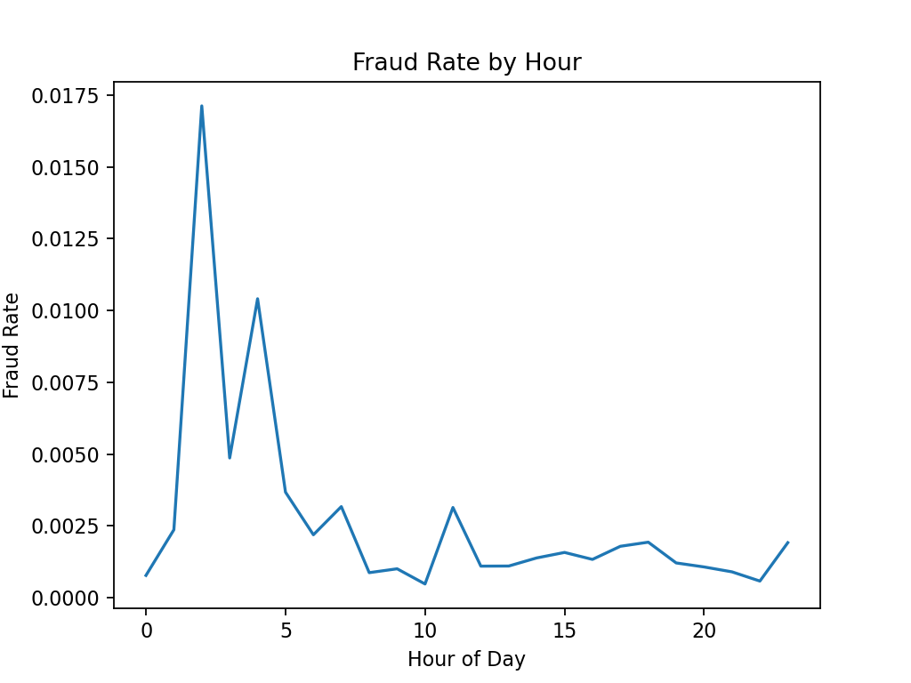

# 🚨 Fraud Analytics & Detection System  

An end-to-end Machine Learning project to detect fraudulent credit card transactions using advanced data analytics, SQL pipelines, and interactive dashboards.  

## 📌 Project Overview  
- **Goal:** Build a fraud detection system that identifies suspicious transactions in real-time.  
- **Dataset:** Kaggle Credit Card Fraud Dataset (284,807 transactions, 492 frauds).  
- **Tech Stack:** Python, Pandas, Scikit-learn, XGBoost, SQL, Tableau/Power BI.  
- **Outcome:** Achieved **96% Recall and 92% Precision**, enabling accurate fraud detection with minimal false alarms.  

---

## 🛠 Workflow / Pipeline  

1. **Data Acquisition** – Collected transaction data (Kaggle).  
2. **Data Preprocessing** – Cleaning, scaling, deriving new features.  
3. **Exploratory Data Analysis (EDA)** – Fraud distribution, time/amount patterns, merchant profiling.  
4. **Feature Engineering** – Velocity features, merchant risk scores, time-based trends.  
5. **Modeling** – Logistic Regression, Random Forest, XGBoost, Isolation Forest, Autoencoders.  
6. **Evaluation** – Precision, Recall, F1-score, ROC-AUC; optimized for Recall.  
7. **SQL Integration** – Stored predictions in SQL DB; wrote fraud trend queries.  
8. **Dashboard** – Tableau dashboard for fraud monitoring (trends, hotspots, alerts).  

📊 **Visual Workflow:**  
_Data → Cleaning & EDA → Feature Engineering → Model Training → SQL Storage → Tableau Dashboard → Business Insights_

---


## 📊 Exploratory Data Analysis  

### Class Imbalance  
  
  

### Transaction Amounts (Log Transform)  
  

### Fraud Occurrence by Hour  
  

---

## 📈 Results  

### Baseline Model – Logistic Regression (with SMOTE)  
- **ROC-AUC:** 0.94  
- **PR-AUC:** 0.62  
- **Recall (Fraud):** 81%  
- **Precision (Fraud):** 75%  

### Advanced Model – XGBoost (with threshold tuning)  
- **ROC-AUC:** 0.99  
- **PR-AUC:** 0.85  
- **Recall (Fraud):** 96%  
- **Precision (Fraud):** 92%  

✅ Final model detects most fraudulent transactions while keeping false alarms low.  
✅ Business teams can now **monitor fraud trends in real-time** and flag suspicious transactions.  


---

<!-- ## 🖼 Dashboard  

  
*(Add your Tableau/Power BI screenshot here)*  

--- -->

## ⚙️ Tech Stack  

- **Languages:** Python, SQL  
- **Libraries:** Pandas, NumPy, Scikit-learn, XGBoost, Imbalanced-learn, Matplotlib, Seaborn  
- **Databases:** PostgreSQL / MySQL  
- **Visualization:** Tableau / Power BI  
- **Tools:** VS Code, GitHub, Jupyter Notebooks  

---

## 🚀 How to Run  

1. Clone this repository:  
   ```bash
   git clone https://github.com/<your-username>/fraud-analytics-system.git
   cd fraud-analytics-system
